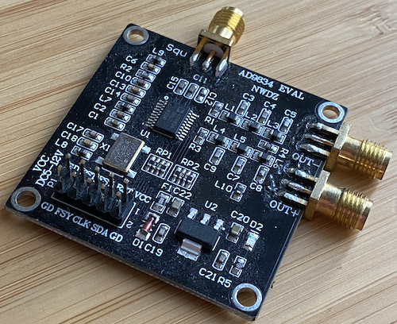

## Simple Arduino AD9834 Library

### Intro
Very simple library for driving the [Analog Devices 9834 DDS Chip](https://www.analog.com/media/en/technical-documentation/data-sheets/AD9834.pdf) - commonly found on breakout boards that look like this:



It was developed for the [Teensy](https://www.pjrc.com/teensy/) Arduino-compatible microcontroller, and should work with any Arduino based MCU.

### Installation
Clone this repo into your libraries directory for your Arduino installation, for example:

```
$ cd ~/Documents/Arduino/libraries
$ git clone https://github.com/AliBarber/AD9834.git
```

### Usage

To keep track of the currently in use FSelect register - you will need to create an instance of the AD9834 class. This library will also use the Arduino SPI library for control. Should you need to configure non-standard pins, use the `SPI.setMOSI()`,`SPI.setMOSI()` and `SPI.setCKD()` functions before initialising the library.

At it's simplest, the following should produce a 14MHz sine wave output, assuming the following physical wiring (AD9834 -> Arduino) and the standard 75MHz crystal on the evaluation board.

```
FSY (Frame Sync) -> Digital I/O Pin 10
CLK -> SPI SCK
SDA -> SPI MOSI
```


```
#include <AD9834.h>

AD9834 *dds;

void setup(){
	dds = new AD9834(10);
	dds->update_freq(14000000);  
}

void loop(){
}
```
